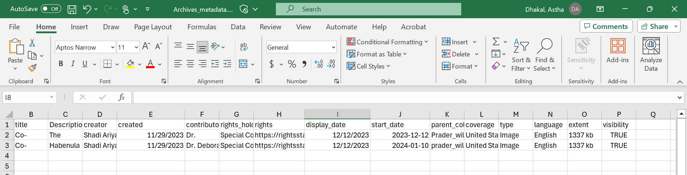

Created by: Astha Dhakal

**HOW TO:**

This document is created as a guide for anyone within Library who wants to add content to Digital Library Preservation (DLP). This document helps users to fill out the collections and archive metadata, as well as to use the rules for many of the columns.

Instructions:

1. Use the attached template spreadsheets to add metadata for collections and archives to upload to the repository.

Collection Template:

Archive Template:

1. Replace example text with your own metadata. Add rows as needed.
2. Only "title" and "identifier" metadata fields are required. Add other fields as desired.
3. Save files as .csv with naming convention such as "collection\_metadata.csv" or "archive\_metadata.csv"
4. Do not use whitespace in filenames. Use "-" or "\_" instead.
5. Make "identifier" values unique by adding a namespace prefix and numbers/strings.
6. Format "start\_date" as YYYY/MM/DD.
7. Most fields support multiple values. Use "||" without quotes to separate.
8. Refer to [wiki](https://github.com/VTUL/dlp-access/wiki/Metadata) for available metadata fields and usage notes.

Rules:

1. Filenames should not contain whitespace. Use "-" or "\_" instead.
2. "Identifier" field values must be unique.
3. "Start\_date" must be formatted as YYYY/MM/DD.
4. Separate multiple values in a field with "||" without quotes.
5. Only single values can be added to fields specified as single value.
6. Follow any special formatting defined on the metadata fields [wiki](https://github.com/VTUL/dlp-access/wiki/Metadata).

**How to** instructions for uploading content to BEDL.

1. Save metadata files as .csv files with these naming conventions:
2. Collection metadata: collection\_metadata.csv
3. Archive metadata: archive\_metadata.csv
4. Digital object filenames: no whitespace, use hyphens or underscores if needed.
5. Add your name or other identifier to metadata identifiers (e.g., JohnSmith\_T000001) to avoid duplicates.
6. Format start\_date as YYYY/MM/DD.
7. For multiple parent\_collection values, combine into one column separated by "||"
8. Remove any notes from submitted files, only include metadata field values.
9. Refer to the metadata fields [wiki](https://github.com/VTUL/dlp-access/wiki/VTDLP-Metadata-Elements) for available fields, data types, and usage guidance: [URL]
10. Use the attached example files for syntax examples of single value, multi value, and Boolean field types.